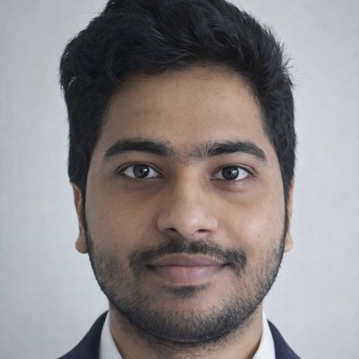

The <strong>Next-generation EXascale and Quantum systems (NEXQ) lab</strong> works on Quantum Computing Systems, and Resilient HPC and AI Systems.

The NEXQ lab has openings for <strong>self-motivated Ph.D. students</strong>, <strong>M.S. students working towards a thesis</strong>, and <strong>motivated undergraduate students</strong>. If you are interested, please send your CV and transcript to bo.fang@uta.edu.

## Research Directions

### Quantum-HPC Driven Scientific Discovery

<figure style="margin:16px 0 20px;overflow-x:auto;">
  
</figure>

Quantum processors are best understood not as replacements for classical computing but as a new class of accelerator in the heterogeneous HPC stack — one whose comparative advantage is sampling from classically intractable probability distributions. We build closed-loop workflows around that division of labor: the QPU proposes a compact candidate subspace, and the classical HPC system solves and refines it at scale.

<!--
### Second Research Direction

Add the title, figure, and description for the second direction here,
following the same pattern as above.
-->

## PhD Students

<!--
To add a student, copy one block below, drop the headshot in /images/, and
point its src at the new file.
-->

  

    
    
<strong>Mark Dubynskyi</strong>

    <ul style="list-style:disc;margin:4px auto 0;padding-left:18px;text-align:left;display:inline-block;line-height:1.1;">
      <li style="margin:0;"><small>Also affiliated with the Department of Mathematics</small></li>
    </ul>
  

  

    
    
<strong>Zubair Faruqui</strong>

    <ul style="list-style:disc;margin:4px auto 0;padding-left:18px;text-align:left;display:inline-block;line-height:1.1;">
      <li style="margin:0;"><small><a href="https://zubairfaruqui10.github.io/">Website</a></small></li>
    </ul>
  

